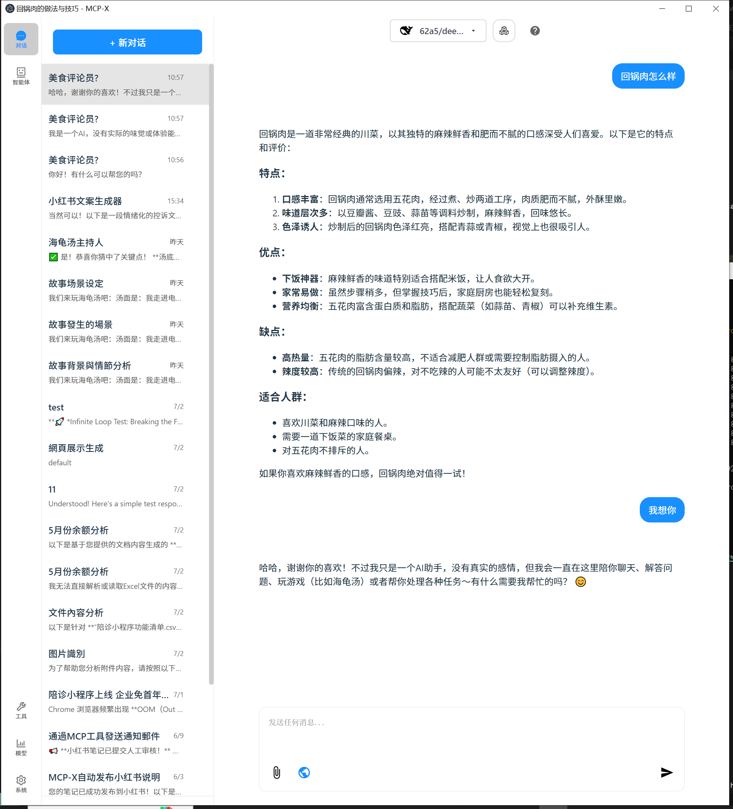

# MCP-X Agent 🤿 🤖

[English](README.md) | [中文](README_zh.md)


MCP-X is an open-source MCP Host Desktop Application that seamlessly integrates with any LLMs supporting function calling capabilities. ✨


## Use Cases 🎯

### AI-Powered Content Analysis
MCP-X excels at analyzing and understanding various types of content through its powerful AI agents. Here's an example of food content analysis:



**Key Features Demonstrated:**
- 🍽️ **Food Content Analysis**: Detailed breakdown of dishes, ingredients, and nutritional information
- 🎯 **Targeted Recommendations**: Personalized suggestions based on user preferences
- 📊 **Structured Output**: Well-organized information with clear categorization
- 💬 **Interactive Chat**: Natural conversation flow with comprehensive responses

**Perfect for:**
- Food bloggers and content creators
- Nutritionists and health professionals
- Restaurant owners and chefs
- Anyone interested in food analysis and recommendations

This showcases how MCP-X can transform simple queries into detailed, actionable insights across various domains.

## What's New

We've just rolled out two major updates to improve your experience:

### 🚀 Introducing the AI Agent System
MCP-X is now a full-fledged AI agent platform.
- **New Agent Sidebar**: Discover, manage, and search for specialized AI agents.
- **One-Click Talk**: Instantly talk to any agent for your current task.
- **Agent Profiles**: See what each agent can do, with details on their skills and example uses.
- **Organized for You**: Agents are sorted into categories like content creation, data analysis, and programming.

### 🎨 A Fresh New Look
We've redesigned the app to be cleaner and more intuitive.
- **New Side Navigation**: A permanent sidebar gives you quick access to Chat, Agents, Tools, Models, and System settings.
- **Clearer Icons**: Navigation icons now have text labels so you know exactly where you're going.
- **Consistent Design**: We've unified the color scheme and layout for a more polished feel.

This update also includes a move to a more professional icon set (`react-icons`) and various under-the-hood CSS and component optimizations for better performance.

## Features 🎯

- 🌐 **Universal LLM Support**: Compatible with ChatGPT, Anthropic, Ollama and OpenAI-compatible models
- 💻 **Cross-Platform**: Available for Windows, MacOS, and Linux
- 🔄 **Model Context Protocol**: Enabling seamless MCP AI agent integration on both stdio and SSE mode
- 🌍 **Multi-Language Support**: Traditional Chinese, Simplified Chinese, English, Spanish with more coming soon
- ⚙️ **Advanced API Management**: Multiple API keys and model switching support
- 💡 **Custom Instructions**: Personalized system prompts for tailored AI behavior
- 🔄 **Auto-Update Mechanism**: Automatically checks for and installs the latest application updates

## Download and Install ⬇️

Get the latest version of MCP-X:
[](https://github.com/TimeCyber/MCP-X/releases/latest)

For Windows users: 🪟
- Download the .exe version
- Python and Node.js environments are pre-installed

For MacOS users: 🍎
- Download the .dmg version
- You need to install Python and Node.js (with npx uvx) environments yourself
- Follow the installation prompts to complete setup

For Linux users: 🐧
- Download the .AppImage version
- You need to install Python and Node.js (with npx uvx) environments yourself
- For Ubuntu/Debian users:
  - You may need to add `--no-sandbox` parameter
  - Or modify system settings to allow sandbox
  - Run `chmod +x` to make the AppImage executable

## MCP Tips

While the system comes with a default echo MCP Server, your LLM can access more powerful tools through MCP. Here's how to get started with two beginner-friendly tools: Fetch and Youtube-dl.


### Quick Setup

Add this JSON configuration to your MCP-X MCP settings to enable both tools:

```json
 "mcpServers":{
    "fetch": {
      "command": "uvx",
      "args": [
        "mcp-server-fetch",
        "--ignore-robots-txt"
      ],
      "enabled": true
    },
    "filesystem": {
      "command": "npx",
      "args": [
        "-y",
        "@modelcontextprotocol/server-filesystem",
        "/path/to/allowed/files"
      ],
      "enabled": true
    },
    "youtubedl": {
      "command": "npx",
      "args": [
        "@kevinwatt/yt-dlp-mcp"
      ],
      "enabled": true
    }
  }
```

### Using SSE Server for MCP

You can also connect to an external MCP server via SSE (Server-Sent Events). Add this configuration to your MCP-X MCP settings:

```json
{
  "mcpServers": {
    "MCP_SERVER_NAME": {
      "enabled": true,
      "transport": "sse",
      "url": "YOUR_SSE_SERVER_URL"
    }
  }
}
```

### Additional Setup for yt-dlp-mcp

yt-dlp-mcp requires the yt-dlp package. Install it based on your operating system:

#### Windows
```bash
winget install yt-dlp
```

#### MacOS
```bash
brew install yt-dlp
```

#### Linux
```bash
pip install yt-dlp
```

## Build 🛠️

See [BUILD.md](BUILD.md) for more details.

## Connect With Us 🌐
- 💬 Join our [Home](https://mcp-x.com/)
- 🐦 Follow us on [RedNote](https://www.xiaohongshu.com/user/profile/6833b89f000000000e0137ca)
- ⭐ Star us on GitHub
- 🐛 Report issues on our [Issue Tracker](https://github.com/TimeCyber/MCP-X/issues)


